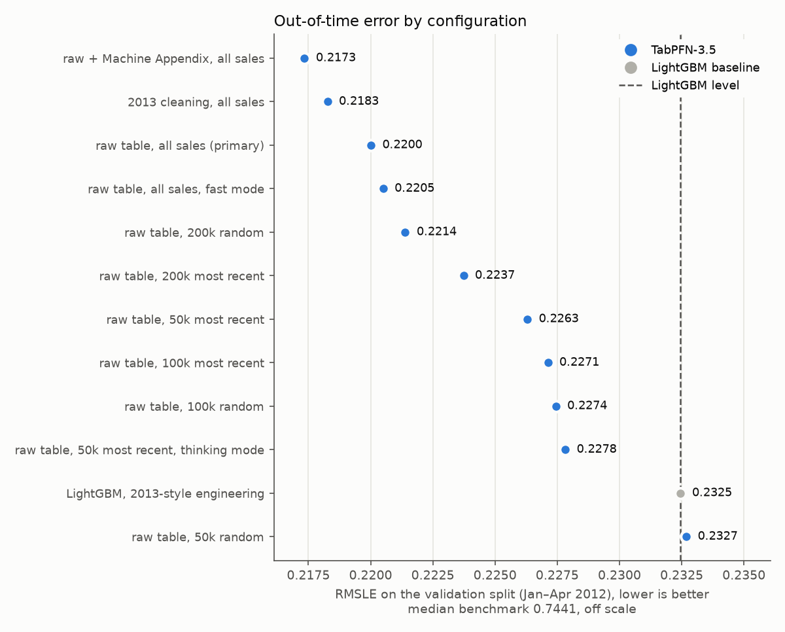
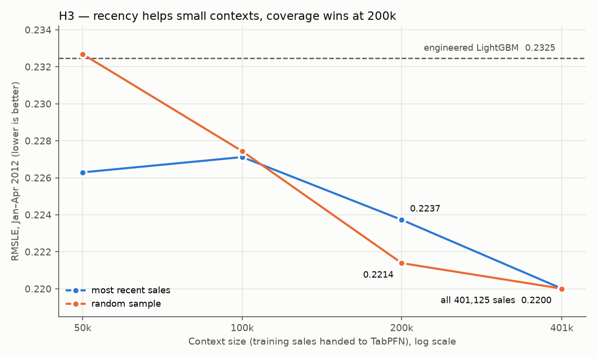
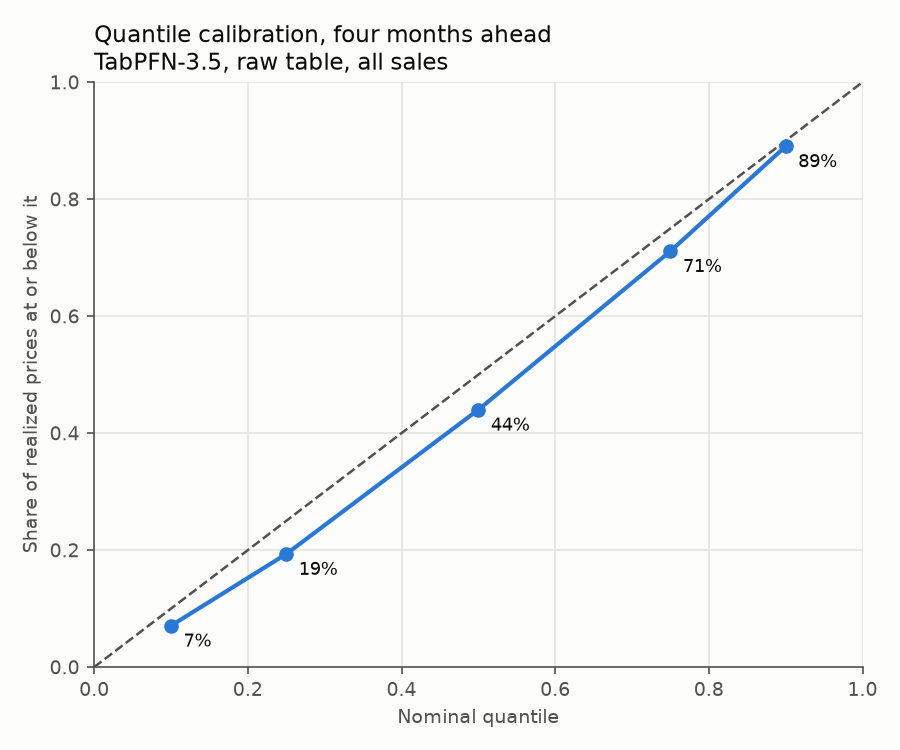
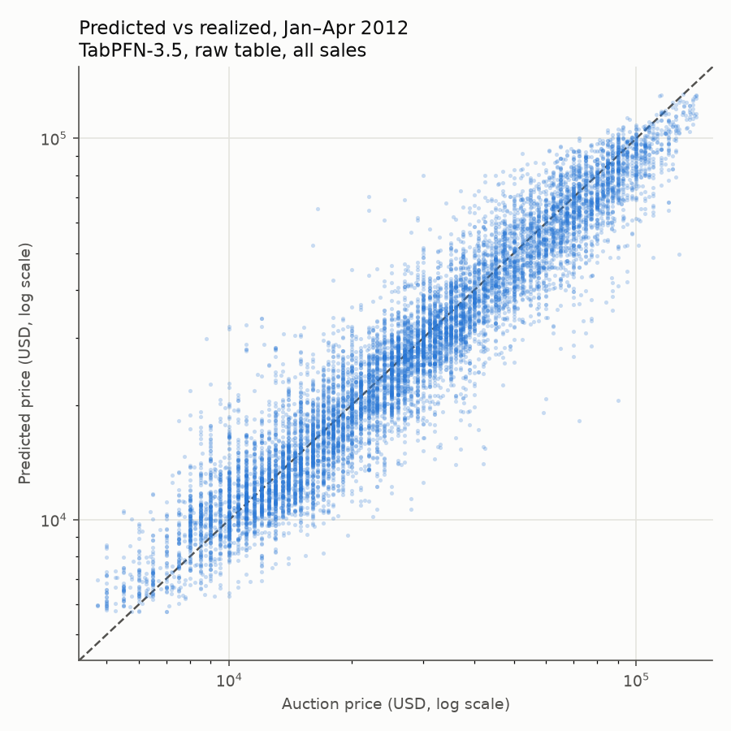
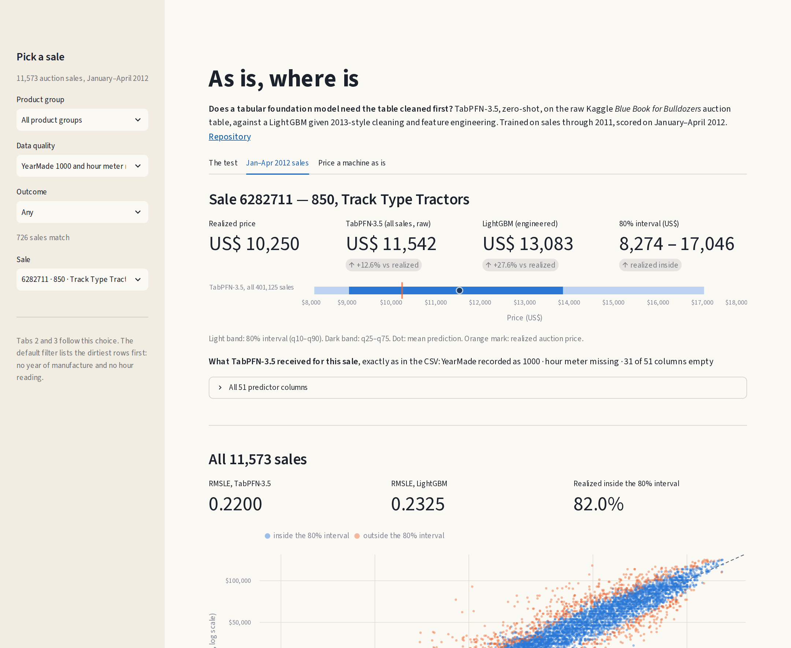

# As is, where is — TabPFN-3.5 on the Blue Book for Bulldozers

Built with **TabPFN-3.5** for the **Prior Labs TabPFN-3.5 Hackathon** — *Take on a Kaggle
challenge*. Author: Agnaldo Calvi Benvenho, mechanical engineer and machinery & equipment
appraiser (this is the author's second entry; the first, on São Paulo real-estate transfer
prices, is [tabpfn-itbi-sp](https://github.com/abenvenho/tabpfn-itbi-sp)).

## The bet

TabPFN-3.5, given the auction table **as it came from Kaggle** — YearMade recorded as 1000
for 9.5% of the sales, the hour meter missing for 64% and zero for another 18%, 35 of the 51
predictor columns more than half empty, 5,218 model codes, free-text descriptions, the sale
date as the CSV string `"3/14/2012 0:00"` — and used **zero-shot**, prices the machines sold
in the following months as well as a LightGBM given 2013-style data cleaning and feature
engineering. (Measured in `results/metrics/noise_audit.json`.) "As it came" means no
cleaning on our side: the values go to `tabpfn-client` as pandas parses them from the CSV;
before upload, the client itself removes commas and repeated spaces from text values, the
same for every arm.

"As is, where is" is the auction clause under which this equipment actually trades: no
warranty, no cleanup. The question is whether a tabular foundation model can price under
the same clause — taking the data as is, where it is.

**Paper:** [paper/bluebook_tabpfn_paper.pdf](paper/bluebook_tabpfn_paper.pdf) (9 pages; LaTeX
source alongside). **Slides:** [docs/bluebook_tabpfn_slides.pdf](docs/bluebook_tabpfn_slides.pdf)
(12 slides). **App:** `streamlit run app/streamlit_app.py` — see [App](#app).

The design is set **against** the bet, and every hypothesis, threshold and analysis
decision is frozen in [PREREGISTRATION.md](PREREGISTRATION.md) *before* the first TabPFN
run on the real data:

| | Hypothesis | Refuted if |
|---|---|---|
| H1 | Raw TabPFN is not worse than engineered LightGBM | worse by > 0.005 RMSLE, 95% CI above 0 |
| H2 | Cleaning the table / joining the "corrected" Machine Appendix does not improve TabPFN | improvement > 0.005 |
| H3 | At equal context size, the most recent sales beat a random sample | random is as good or better |
| H4 | The 80% predictive interval holds four months ahead | coverage outside 75–85% |
| H5 | The primary raw run scores in the 2013 top 10% on the leaderboard-mirror split | validation RMSLE > 0.25339 |

The out-of-time validation split is scored against `ValidSolution.csv`, published by the
competition — prices the producer of the predictions cannot touch. Kaggle no longer
accepts late submissions for this competition (verified while signed in, 2026-09-30,
before any run), so the planned second referee — Kaggle scoring the hidden test set — is
unavailable; H5 instead compares the primary run, on the split that mirrors the 2013
public leaderboard, against the final-leaderboard top-10% score, a caveat stated in
PREREGISTRATION.md. The `Test.csv` submission file is still produced and versioned, and a
Kaggle score supersedes H5 if late submissions ever reopen.

## Why this dataset

The 2013 *Blue Book for Bulldozers* competition (Fast Iron / Kaggle) asked for auction
prices of ~412k pieces of heavy equipment from usage, type and configuration — a machinery
valuation problem, which is the author's professional practice. It is a canonical *dirty*
tabular benchmark: 53 columns full of missing and erroneous values, high-cardinality
codes, and a strict temporal split. Top teams in 2013 reported that the "corrected"
Machine Appendix did **not** help — the 9th
([Seroussi](https://yanirseroussi.com/2014/11/19/fitting-noise-forecasting-the-sale-price-of-bulldozers-kaggle-competition-summary/)),
16th ([Olariu](http://webmining.olariu.org/trees-ridges-and-bulldozers-made-in-1000-ad/)) and
20th ([Dataiku](https://blog.dataiku.com/2013/04/26/kaggle-contest-blue-book-for-bulldozers))
placed teams among them; here that report becomes a falsifiable hypothesis (H2). Those teams
also fitted separate models per product group and searched their hyper-parameters, and two of
them (9th and 16th) blended several models (gradient boosting, random forests, linear
models) — none of which the LightGBM baseline here does (see *Limits*).

## Results

**TabPFN-3.5, zero-shot on the raw table with all 401,125 sales, scores RMSLE 0.22001 on
the four months that followed (Jan–Apr 2012). A LightGBM with 2013-style cleaning and
feature engineering scores 0.23246.** Four of the five pre-registered hypotheses survive;
H3 is refuted. Every number below is regenerated by `src/compare.py` (verdicts),
`src/explore.py` (exploratory) and `src/make_figures.py` from the files in `results/`.

| | Hypothesis | Measured (paired bootstrap, 95% CI) | Verdict |
|---|---|---|---|
| H1 | Raw TabPFN not worse than engineered LightGBM | RMSLE(raw) − RMSLE(LightGBM) = **−0.01245** (−0.01480 .. −0.01021) | **corroborated** |
| H2 | Cleaning does not improve TabPFN | RMSLE(raw) − RMSLE(clean) = +0.00175 (+0.00083 .. +0.00270) | **corroborated** (see below) |
| H2 | The Machine Appendix does not improve TabPFN | RMSLE(raw) − RMSLE(appendix) = +0.00267 (+0.00150 .. +0.00388) | **corroborated** (see below) |
| H3 | Most recent sales beat a random sample, at equal size | 50k: −0.00639 (−0.00839 .. −0.00440) · 100k: −0.00032 (−0.00215 .. +0.00152) · **200k: +0.00234 (+0.00079 .. +0.00389)** | **REFUTED** |
| H4 | The 80% interval holds four months ahead | coverage **82.0%** (band 75–85%) | **corroborated** |
| H5 | Primary run in the 2013 top 10% (leaderboard-mirror split) | 0.22001 vs 0.25339 | **corroborated**, with the pre-registered caveat |



**H1 — the raw table beats the engineered model.** The pre-registered claim was the weak
one: "not worse". The data say more: the raw table is better, with the whole interval
below zero. In a point comparison outside the pre-registration, ten of the eleven
distinct TabPFN configurations run here have a lower RMSLE than the engineered LightGBM;
the exception is a random sample of only 50k sales (0.23268).

**H2 — cleaning helps, but by less than the pre-registered margin.** H2 is corroborated by
the frozen rule: an improvement had to exceed 0.005 RMSLE to refute it. Read without the
margin, the sentence "cleaning does not improve TabPFN" would be false: both intervals lie
above zero, so the 2013 cleaning (0.21826) and the Machine Appendix join (0.21734) do help.
The gains are about a third (cleaning) and about half (appendix) of the margin, and about
a seventh (cleaning) and a fifth (appendix) of the advantage the raw table already holds
over the engineered LightGBM. The report from 2013 that the "corrected" appendix did not help (see
*Why this dataset*) is not reproduced in its strong form here: with TabPFN it helps a
little.

**H3 — refuted: recency helps only when the context is small.** H3 was written as a
universal claim over context sizes, and the 200k comparison refutes it with an interval
entirely above zero. With 50k sales the most recent ones clearly win; at 100k the two
samplings tie; at 200k a random sample across 23 years of auctions (1989–2011) beats the
most recent 200k. For an appraiser this reads like the familiar trade-off in choosing comparables:
with few of them, recency carries the current market; with many, coverage of models and
configurations matters more — an interpretation, not something this study tested. Both
lines meet at all 401,125 sales, the best point of the curve by point estimate.



**H4 — the interval holds; a small bias remains, its cause not established.** The 80%
interval [q10, q90] covers 82.0% of the realized prices four months ahead. All five
quantiles sit slightly below the diagonal (7%, 19%, 44%, 71% and 89% of realized prices
at or below q10, q25, q50, q75, q90): realized prices ran higher than predicted, by 2.6%
in geometric mean (mean log1p residual +0.0256). The cause was not tested. A general
price rise is not supported: the Jan–Apr median sale price was US$ 27,000 in both 2011
and 2012. Seasonality is compatible: in 2009, 2010 and 2011 the Jan–Apr median ran above
the full-year median (23,000 vs 22,000; 24,000 vs 23,500; 27,000 vs 26,000).



**H5 — corroborated, but it is not a leaderboard rank.** The primary run's 0.22001 is
below the 2013 top-10% mark (0.25339) and numerically below even the 2013 winning score
(0.22909). Those 2013 scores were computed by Kaggle on the hidden May–Nov 2012 test set;
this one is computed on the Jan–Apr 2012 split that mirrored the public leaderboard,
because Kaggle no longer accepts late submissions. The comparison is indicative, as
pre-registered, and no claim of a leaderboard position is made. The submission file for
the hidden test set is in `results/submission_kaggle_primary.csv`.



### Exploratory, not pre-registered

Full tables in [`results/exploratory.md`](results/exploratory.md); none of this changes a
verdict.

- **Fast mode** (`v3.5-fast`, all sales): RMSLE 0.22050, a difference of +0.00049
  (−0.00065 .. +0.00163) against the base model — no detectable loss — in 813 s of wall
  time instead of 1,654 s.
- **Thinking mode** (extra fit-time search optimising RMSE of log1p(price)) failed on the
  server twice at the planned 200k context ("The worker failed to process this request";
  request_ids `a724cd8f2ce84f9cabad7e6de3d06c74`, `ca766e3690b6410588dcc297d6439758`). At
  50k it ran and scored 0.22782, worse than the base model on the same 50k (0.22630;
  difference +0.00152, +0.00033 .. +0.00274). Without `time_col` (it requires datetimes
  or numbers, and the raw arm keeps the date as text), its internal validation does not
  use contiguous blocks of time; whether that explains the result was not tested.
- **Reproducibility of the API.** The 50k pilot (2026-09-30) and the identical 50k
  configuration in the H3 block (2026-10-01) produced the same mean and the same five
  quantiles for all 11,573 validation sales, to the cent.
- **Measured cost.** The API's usage counter was read after each block on 2026-10-01, and
  once during the first (`results/usage_log.txt`). It is the monthly counter (limit
  20,000,000, reset 2026-11-01), so the arms figure assumes it started at zero on
  October 1; the mid-block reading (182,967) equals the quote of that block's first call,
  which supports this. Against the server quotes (`results/cost_quote_2026-10-01.txt`,
  from `scripts/02_estimate_cost.py`), measured spend matched exactly for the arms
  (732,938 tokens) and context (326,828) blocks. The Kaggle block cost twice its quote
  (730,546 vs 365,272), consistent with the client's automatic retry of a long request,
  but not confirmed. The blocks of 2026-10-01 used 2,357,700 tokens in total. The daily
  limit of 5,000,000 tokens is the one stated in the API's HTTP 429 message of 2026-09-30
  (`results/api_errors.txt`).

### External reference on the same basis

The 2013 winning score (0.22909) cannot be compared with this study's numbers. It was
computed on the hidden May–Nov 2012 test set by a model trained with data through April
2012, and that set can no longer be scored. The public leaderboard was computed on the
same Jan–Apr 2012 sales as here, but it is contaminated: the validation prices were
released in the competition's last week, and 108 of 475 teams show an RMSLE of 0.0 on it
([Parr & Howard](https://mlbook.explained.ai/bulldozer-testing.html)).

One published model does share this study's basis. In *The Mechanics of Machine Learning*,
[Parr & Howard](https://mlbook.explained.ai/bulldozer-testing.html) use Kaggle's
`Valid.csv` (sales of 2012-01-01 to 2012-04-28) as their test set and train only on sales
through 2011 (from 2007 on). Their tuned random forest, with feature selection and an
inflation adjustment, scores **RMSLE 0.2396** there.

| Model, evaluated on Jan–Apr 2012, trained on sales through 2011 | RMSLE |
|---|---|
| TabPFN-3.5, raw table + Machine Appendix, all sales | 0.21734 |
| **TabPFN-3.5, raw table, all sales (primary)** | **0.22001** |
| LightGBM, 2013-style cleaning and features (this study) | 0.23246 |
| Random forest, Parr & Howard | 0.2396 |

This is a point comparison only: their predictions are not available, so no paired test
is possible. It is context, not a pre-registered hypothesis.

### Deviations from the pre-registration

Logged as the pre-registration requires; where a choice was open, it went to the weaker claim.

1. **H5 referee.** Kaggle late submissions turned out to be closed; H5 was rewritten
   *before any run* (commit `def3ffc`) to the leaderboard-mirror comparison above.
2. **Pilot before the context freeze.** The 50k pilot ran before the primary context was
   frozen. The selection rule is mechanical and had been committed beforehand, so the
   pilot could not influence it. For H3 at 50k, `src/compare.py` happens to pair the
   pilot's prediction file, which is identical row by row to the 50k-recent run of the
   H3 block, so the verdict is the same either way.
3. **Primary context = all sales.** The rule picked the largest context that fits the
   quota; the server quote of 2026-09-30 (181,897 tokens for all 401,125 sales), recorded
   in the message of commit `442fd3f` before the primary run, made that all sales. The re-quote of
   2026-10-01 (`results/cost_quote_2026-10-01.txt`) gives the same values.
4. **Modes.** Thinking was moved from the primary context to 200k before any modes run,
   because the API caps thinking at 200k rows; it then failed twice server-side and ran
   at 50k. The fast/thinking model identifiers in the runner were wrong and were fixed
   after the H2 arms had run (commit `769e5e2`); the base-model path, used by every
   pre-registered comparison, was not changed.
5. **H3 at 100k.** The pre-registered rule uses the point estimate (refuted iff
   recent − random ≥ 0); at 100k it is −0.00032, so that size counts as corroborating,
   although its interval spans zero. H3 is refuted by the 200k comparison either way.
6. **H3 rule wording.** PREREGISTRATION.md writes the H3 refutation rule as "random ≥
   recent (diff ≤ 0)" without defining *diff*. It is read as in the hypothesis table
   ("random is as good or better") of this README and in `src/compare.py`, both
   committed before any run: refuted at a given size iff RMSLE(recent) − RMSLE(random)
   ≥ 0. An independent audit noted that the opposite reading of *diff* would flip which
   sizes refute (50k and 100k instead of 200k), and that it would refute H3 exactly when
   the recent sales win — against the hypothesis's own direction. H3 is refuted under
   either reading.
7. **Unexplained quota use on 2026-09-30.** The API refused further calls that day with
   "Daily usage limit reached" (5,000,000 tokens; `results/api_errors.txt`) after the
   pilot and primary runs, whose quotes add up to about 0.4M tokens. Both refused calls
   came after the limit had been reached. Usage was not yet being read, so the rest
   cannot be attributed.

### Limits

- **One evaluation period**, January to April 2012. Other periods may differ.
- **A plain adversary.** The LightGBM has fixed hyper-parameters, no Machine Appendix, no
  per-group models and no blending; the 2013 top teams used per-group models and tuning,
  and some of them blends, so a stronger adversary is possible.
- **One table, one market.** The finding is not tested on other data.
- **The independent audit was done by an AI agent**, not a person, recomputing every number
  in this README from the result files with its own code.

## App

```bash
.venv/bin/streamlit run app/streamlit_app.py      # from the repository root
```

Three tabs; the first two read only this repository's files, the third calls the API:

- **The test** — the bet, the five pre-registered verdicts and the figures, from `results/`.
- **Jan–Apr 2012 sales** — every validation sale: realized price, TabPFN-3.5 with its 80%
  interval, and the engineered LightGBM, from the versioned prediction files (no API call).
  With the Kaggle files prepared (`data/prepared/`), it also shows the machine's raw
  attributes as TabPFN-3.5 received them, and breakdowns by product group and by data
  quality of the row (year recorded as 1000, hour meter missing or zero).
- **Price a machine as is** — edit a sale's raw attributes, dirty values included, and ask
  TabPFN-3.5 live through the Prior Labs API, with the 50,000 most recent training sales as
  context (the 50k-recent configuration of H3). Needs `data/prepared/` and your own token.
  The server's cost quote comes before any paid call, and the usage counter is read before
  and after it. It can also price the 2013-cleaned version of the same row.

The breakdowns and live prices are exploratory and change no verdict.
`BLUEBOOK_APP_MOCK=1` runs the app with the smoke test's stand-in model instead of
TabPFN-3.5, and every live result then says so.



## Reproducing

```bash
python3 -m venv .venv && .venv/bin/pip install -r requirements.txt
bash scripts/90_smoke.sh          # end-to-end check on synthetic data — no API, no token;
                                  # runs in a temporary copy, results/ is left untouched
```

With the Kaggle files in `data/raw/` (see [DATA_NOTICE.md](DATA_NOTICE.md)) and a Prior
Labs token in `TABPFN_TOKEN`:

```bash
.venv/bin/python scripts/00_check_api.py            # API + quantiles
.venv/bin/python scripts/01_prepare.py              # splits + noise audit
.venv/bin/python scripts/02_estimate_cost.py        # server cost quote — spends nothing
bash scripts/10_baselines.sh                        # median + engineered LightGBM
bash scripts/20_tabpfn.sh pilot                     # 50k-context pilot
PRIMARY_CTX=all bash scripts/20_tabpfn.sh primary   # H1, H4, H5
PRIMARY_CTX=all bash scripts/20_tabpfn.sh arms      # H2 (clean, appendix)
bash scripts/20_tabpfn.sh context                   # H3 (recent vs random)
PRIMARY_CTX=all bash scripts/20_tabpfn.sh modes     # fast (all) + thinking (200k)
PRIMARY_CTX=all bash scripts/20_tabpfn.sh kaggle    # submission file for Test.csv
.venv/bin/python scripts/03_usage.py --tag LABEL    # API usage reading — spends nothing
.venv/bin/python -m src.compare --primary primary_raw
.venv/bin/python -m src.explore
.venv/bin/python -m src.make_figures --primary primary_raw
```

The primary context size is chosen from the cost quote **before any result is seen**
(PREREGISTRATION.md). The blocks run on 2026-10-01 (arms to thinking) used 2,357,700
tokens; the pilot and primary runs of the day before are quoted at about 0.4M. The
primary run alone takes about 28 minutes of wall time.

## Repository layout

```
PREREGISTRATION.md      frozen hypotheses, thresholds and analysis decisions
paper/                  the paper (PDF and LaTeX source)
docs/                   presentation slides (PDF), app screenshot
app/                    Streamlit app (streamlit_app.py); theme in .streamlit/
DATA_NOTICE.md          what to download from Kaggle; what is (not) redistributed
scripts/                00 api check · 01 prepare · 02 cost quote · 03 usage reading ·
                        05 synthetic · 10 baselines · 20 tabpfn blocks · 90 smoke test
src/                    schema · prepare · features · baselines · tabpfn_runner ·
                        metrics · compare (verdicts) · explore (not pre-registered) ·
                        make_figures
data/raw/               Kaggle files (not versioned)
results/                predictions, metrics, scoreboard.md, verdicts.md,
                        exploratory.md, figures/, usage_log.txt, cost quote,
                        submission_kaggle_primary.csv
```

## License and credits

Code under [Apache-2.0](LICENSE). TabPFN and TabPFN-3.5 are developed by
[Prior Labs](https://priorlabs.ai) and used here through the Prior Labs API. Competition
data © Fast Iron / Kaggle, under the competition rules (not redistributed). See
[CITATION.cff](CITATION.cff).
